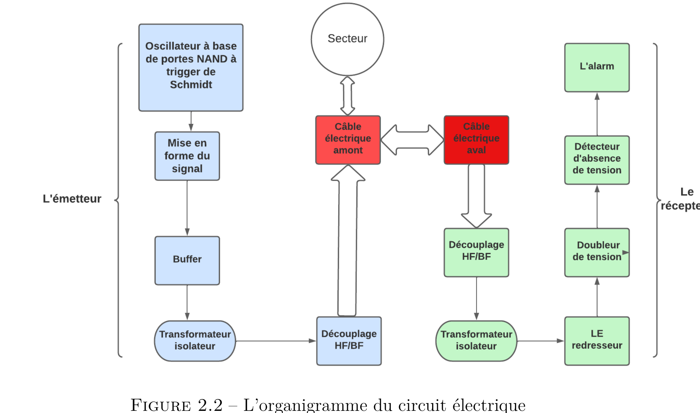
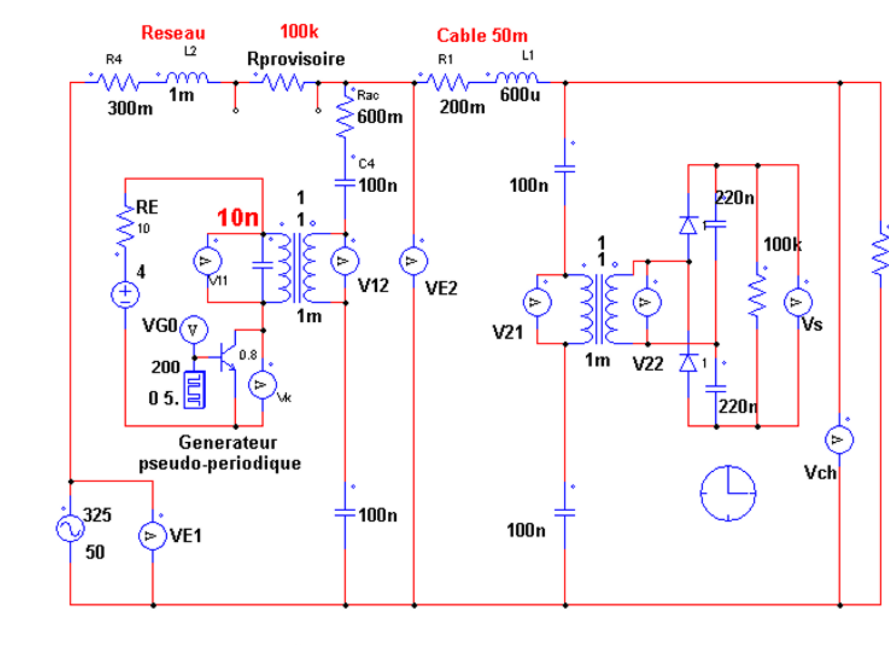
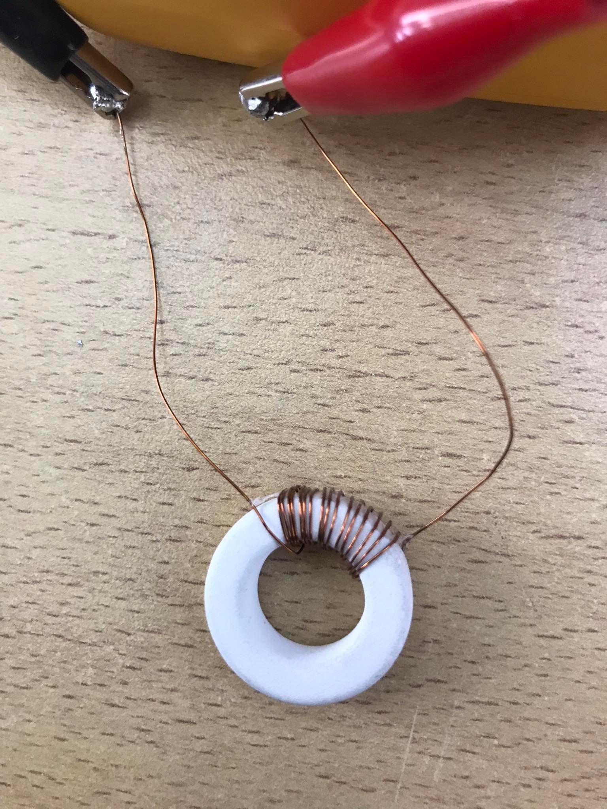
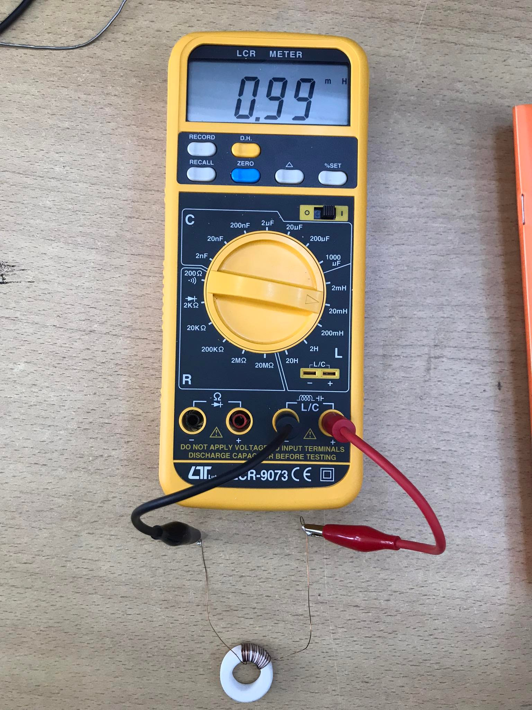
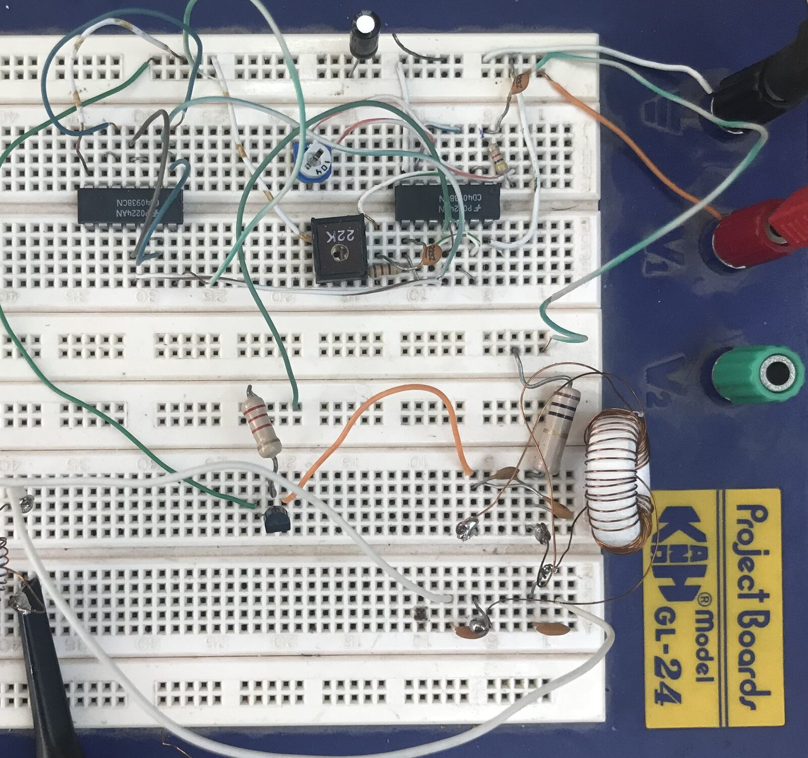
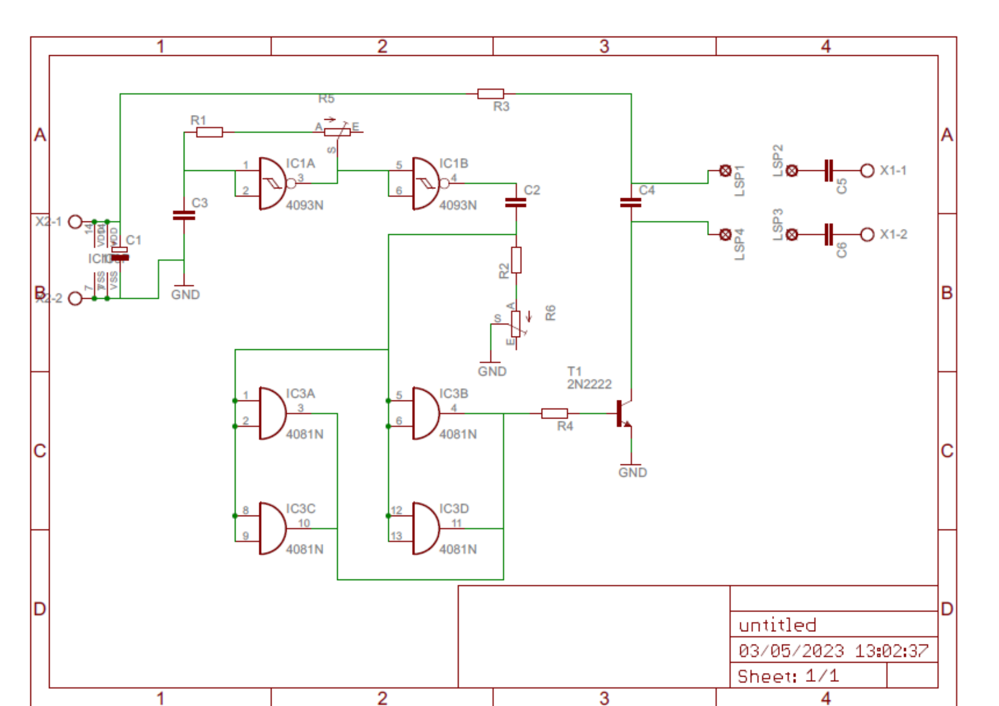
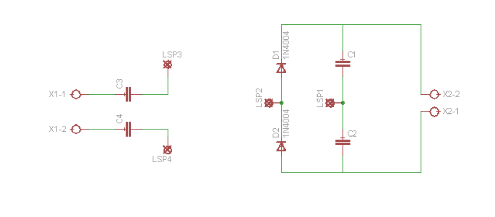
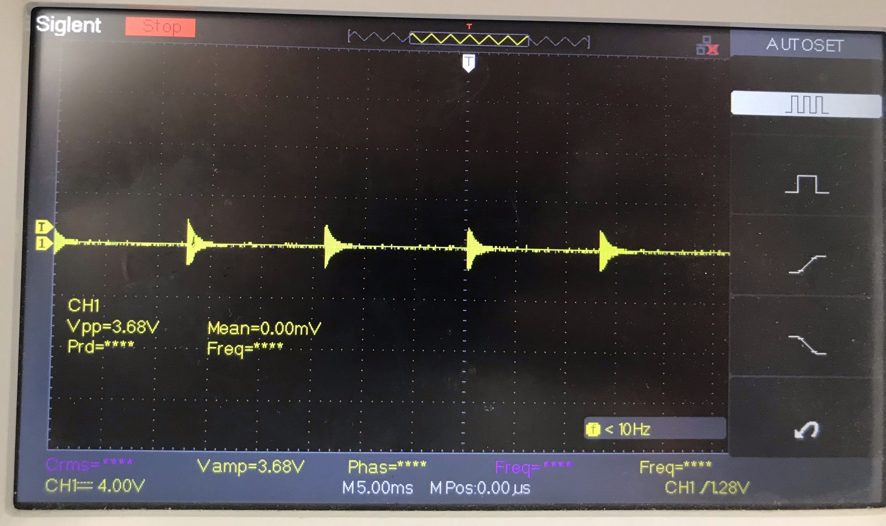

# Détecteur de Coupure de Câble Électrique — Système Antivol

> Projet de Fin d'Année (ENIT — 2ᵉ Année Génie Électrique) — Détection instantanée de coupure de câbles électriques en cuivre par injection de signal haute fréquence, avec alarme dissuasive automatique.

**Auteurs :** Rayen Yadir
**Encadrant :** M. Férid Kourda — École Nationale d'Ingénieurs de Tunis (ENIT)

---

## Table des matières

- [Contexte et problématique](#contexte-et-problématique)
- [Principe de fonctionnement](#principe-de-fonctionnement)
- [Architecture du circuit](#architecture-du-circuit)
- [Étude et dimensionnement](#étude-et-dimensionnement)
- [Réalisation pratique](#réalisation-pratique)
- [Conception PCB (Eagle)](#conception-pcb-eagle)
- [Résultats](#résultats)
- [Outils utilisés](#outils-utilisés)
- [Contenu du dépôt](#contenu-du-dépôt)
- [Limites et perspectives](#limites-et-perspectives)

---

## Contexte et problématique

Le vol de câbles électriques en cuivre cause des perturbations réseau et des pertes financières importantes. Les systèmes dissuasifs existants (détecteurs de mouvement) sont répétitifs et sujets à l'accoutumance du voleur.

Ce projet propose une solution alternative : la détection **instantanée** d'une coupure de câble — qu'il soit sous tension ou hors tension, quelle que soit sa longueur (tests réalisés jusqu'à 50 m, configuration représentative du réseau de l'ENIT) — couplée au déclenchement automatique d'une alarme.

---

## Principe de fonctionnement

Un signal haute fréquence pseudo-périodique est injecté en permanence par un **émetteur** à une extrémité du câble. Un **récepteur** à l'autre extrémité surveille la présence continue de ce signal :

- **Câble intact** → le signal est reçu en continu → alarme désactivée
- **Câble coupé** → le signal disparaît instantanément → l'alarme se déclenche automatiquement (cycle 15 s ON / 45 s OFF)



---

## Architecture du circuit

Le système est composé de deux blocs principaux reliés par le câble à surveiller :



### Partie émetteur

- **Bloc de commande** : oscillateur à portes NAND trigger de Schmitt (CD4093), fréquence ajustable de 0.5 à 5 kHz, suivi d'un monostable à largeur d'impulsion variable
- **Générateur apériodique** : transistor 2N2222 + dipôle LC, génère un signal pseudo-périodique à ≈ 23 kHz par cycles de charge/décharge
- **Transformateur isolateur** + découplage HF/BF pour l'injection sur le câble en présence du secteur

### Partie récepteur

- **Redressement et doublage de tension** (2 diodes + 2 condensateurs)
- **Détecteur de présence** : comparateur à seuil (4.7 V, protégé par diode zener) déterminant l'état du câble
- **Commande d'alarme** : logique ET + transistor pilotant un module de commande sans fil

---

## Étude et dimensionnement

### Modélisation du câble

Le câble est modélisé comme un circuit RL : résistance 200 mΩ, inductance 600 µH, validé expérimentalement sur 5 types de câbles différents (souples/rigides, diamètres 7.3 à 18.1 mm).

| Fréquence | Atténuation observée |
|---|---|
| 1 kHz → 100 kHz | Aucune (signal stable) |
| 1 MHz | Distorsion significative |

→ La bande de travail retenue (≈ 20–23 kHz) est largement dans la zone sûre.

### Dimensionnement du transformateur

Trois méthodes de mesure d'inductance comparées (LCR-mètre, méthode expérimentale par décharge RC, simulation PSIM) :



Le premier noyau ferrite (59 mH, fréquence propre ≈ 2 kHz) s'est révélé inadapté. Un noyau plus grand a permis d'atteindre 1 mH avec seulement 17 spires, donnant une fréquence propre cohérente avec le cahier des charges (≈ 23 kHz).



---

## Réalisation pratique

Validation progressive sur plaque d'essai avant intégration complète :

| Étape | Résultat |
|---|---|
| Bloc de commande | Signal MLI conforme aux fréquences théoriques (253 Hz / 338 Hz selon réglage) |
| Générateur apériodique (transfo 59 mH) | Fréquence insuffisante (1.24 kHz) → transformateur rejeté |
| Générateur apériodique (transfo 1 mH) | Fréquence propre 24 kHz, conforme à la théorie |
| Circuit complet | Bonne concordance simulation / pratique |



Le signal redressé en sortie du récepteur présente un minimum d'amplitude de 1.8 V, utilisé comme seuil de comparaison pour la détection.

---

## Conception PCB (Eagle)

Les schémas électriques et plans de routage ont été réalisés sous **Eagle CAD**.

| Émetteur | Récepteur |
|---|---|
|  |  |
| 
|
 |

Le fichier source Eagle (`.sch`) est disponible dans [`/eagle`](eagle/).

> **Note :** le fichier de board layout (`.brd`) n'est pas disponible séparément ; les plans de routage PCB sont fournis en image (exports du rapport).

---

## Résultats

- Détection fonctionnelle et instantanée d'une coupure de câble, validée en pratique sur plusieurs types de câbles jusqu'à 30–50 m
- Bonne corrélation entre les résultats de simulation PSIM et les mesures à l'oscilloscope
- Signal de transmission insensible à l'atténuation pour toute la bande de fréquence utile (< 100 kHz)



---

## Outils utilisés

| Outil | Usage |
|---|---|
| **PSIM** | Simulation du circuit électronique de puissance |
| **Eagle CAD** | Schémas électriques et conception des circuits imprimés (PCB) |
| **Oscilloscope (Siglent / DQ2062CN)** | Validation expérimentale des signaux |
| **LCR-mètre** | Mesure d'inductance des transformateurs |

---

## Contenu du dépôt

```
cable-cut-detector/
├── docs/
│   ├── Rapport_PFA.pdf            # Rapport complet du projet
│   └── Simu-Impec-...docx                # Annexe simulation/impédance
├── eagle/
│   └── Alarme.sch    # Schéma Eagle source
├── images/                                # Figures du rapport (schémas, PCB, mesures)
└── README.md
```

---

## Limites et perspectives

- L'impact du signal injecté sur le réseau électrique (conformité aux normes en vigueur) reste à approfondir
- Tests complémentaires à mener en présence de tension à vide et sous charge (jusqu'à 15 A)
- Le fichier de routage PCB (`.brd`) gagnerait à être reconstruit pour permettre une fabrication directe des cartes

---

## Références

1. Oscillateur RC — fmuser.net
2. Tore en Ferrite — sonelecmusique.com

**Auteurs :** Rayen Yadir
**Encadrant :** M. Férid Kourda — École Nationale d'Ingénieurs de Tunis (ENIT)
